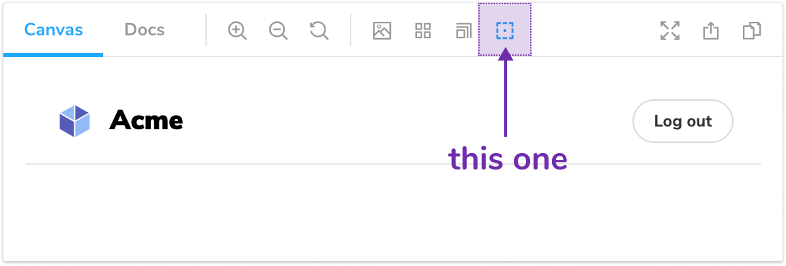

Empecemos por el archivo `src/Tool.js`. Aquí es donde vivirá el código UI de la herramienta Outline. Observa la importación de [@storybook/components](https://www.npmjs.com/package/@storybook/components). Esta es la biblioteca de componentes propia de Storybooks, construida con React y Emotion. Se usa para construir, bueno, el propio Storybook ([demo](https://next--storybookjs.netlify.app/official-storybook/)). También podemos usarlo para construir nuestro complemento.

En este caso, usaremos los componentes `Icons` y `IconButton` para crear la herramienta de selección de contorno. Modifica tu código para usar el ícono `outline`  y dale un título apropiado.

```js:title=src/Tool.js
import React, { useCallback } from 'react';
import { useGlobals } from '@storybook/api';
import { Icons, IconButton } from '@storybook/components';
import { TOOL_ID } from './constants';

export const Tool = () => {
  const [{ myAddon }, updateGlobals] = useGlobals();

  const toggleMyTool = useCallback(
    () =>
      updateGlobals({
        myAddon: !myAddon,
      }),
    [myAddon]
  );

  return (
    <IconButton
      key={TOOL_ID}
      active={myAddon}
      title="Apply outlines to the preview"
      onClick={toggleMyTool}
    >
      <Icons icon="outline" />
    </IconButton>
  );
};
```

Pasando a manager.js, aquí registramos el complemento con Storybook usando un archivo único `ADDON_ID`. También registramos la herramienta con una identificación única. Recomendamos algo como `storybook/addon-nombre`. El kit Addon también incluye ejemplos de pestañas y paneles. El complemento Outline solo usa una herramienta, por lo que podemos eliminar las demás.

```js:title=src/preset/manager.js
import { addons, types } from '@storybook/addons';

import { ADDON_ID, TOOL_ID } from '../constants';
import { Tool } from '../Tool';

// Register the addon
addons.register(ADDON_ID, () => {
  // Register the tool
  addons.add(TOOL_ID, {
    type: types.TOOL,
    title: 'My addon',
    match: ({ viewMode }) => !!(viewMode && viewMode.match(/^(story|docs)$/)),
    render: Tool,
  });
});
```

Notice the match property. It allows you to control which view mode the addon will be enabled in. In this case, the addon will be available in story and docs mode.

Observa la propiedad 'match'. Permite controlar en qué modo de visualización se habilitará el complemento. En este caso, el complemento estará disponible en el modo historia y documentación.

En este punto, deberías ver la herramienta de selección de contorno en la barra de herramientas  🎉


