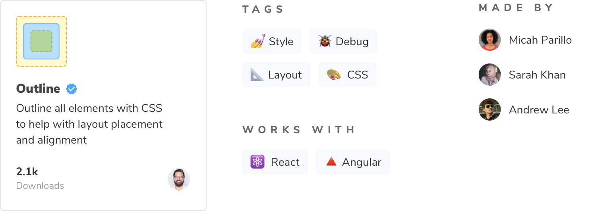

Le [catalogue d'addon](https://storybook.js.org/addons) abrite tous les addons Storybook. C'est là que nous affichons vos addons et où les développeurs en découvrent de nouveaux. Préparons votre addon pour le release, l'empaqueter et le publier dans le catalogue.


## Préparer votre addon pour le release

Les addons storybook, comme la plupart des packages de l'écosystème JavaScript, sont distribués via npm. Cependant, ils remplissent certains critères :

1. Ils ont un répertoire dist contenant le code ES5 transpilé.
2. Un fichier `preset.js` à la racine, écrit en tant que module ES5.
3. Un fichier `package.json` déclarant :
   - Les dépendances paires
   - Les informations liées au module
   - Les métadonnées pour le catalogue

L'Addon Kit se charge de presque tout ça pour nous. Nous devons juste nous assurer de fournir des métadonnées adéquates.

## Métadonnées du module

La première catégorie concerne les métadonnées liées au module. Cela inclut le point d'entrée principal du module et quels fichiers à inclure lorsque vous publiez votre addon, ainsi que toutes les dépendances paires de l'addon. Par exemple, react, react-dom et toutes les APIs liées à Storybook.

```json:title=package.json
{
  ...
  "main": "dist/preset.js",
  "files": [
    "dist/**/*",
    "README.md",
    "*.js"
  ],
  "peerDependencies": {
    "@storybook/addons": "^6.1.14",
    "@storybook/api": "^6.1.14",
    "@storybook/components": "^6.1.14",
    "@storybook/core-events": "^6.1.14",
    "@storybook/theming": "^6.1.14",
    "react": "^16.8.0 || ^17.0.0",
    "react-dom": "^16.8.0 || ^17.0.0"
  },
  ...
}
```

#### Pourquoi les dépendances paires ?

Imaginons que vous créez une bibliothèque de formulaire fonctionnant avec React. Si vous incluez React comme dépendance, tout le code de React sera empaqueté dans votre bibliothèque. Imaginons maintenant que vos utilisateurs ont déjà React d'installé dans leur codebase. Si les versions diffèrent, leur application va planter. C'est le même principe ici.

## Métadonnées pour le catalogue

En plus des informations liées au module, vous devez préciser quelques métadonnées pour le catalogue d'addons Storybook.



Certaines de ces informations sont pré-configurées par l'Addon Kit. Des choses comme le nom public, l'icône ou la compatibilité des différents frameworks sont définies par la propriété storybook. Consultez la [documentation des métadonnées d'Addons](https://storybook.js.org/docs/react/addons/addon-catalog/#addon-metadata) pour une spécification complète de l'API des métadonnées.

```json:title=package.json
{
  ...
  "name": "my-storybook-addon",
  "version": "1.0.0",
  "description": "My first storybook addon",
  "author": "Your Name",
  "storybook": {
    "displayName": "My Storybook Addon",
    "unsupportedFrameworks": ["react-native"],
    "icon": "https://yoursite.com/link-to-your-icon.png"
  },
  "keywords": ["storybook-addons", "appearance", "style", "css", "layout", "debug"]
  ...
}
```

La propriété keywords se réfère aux tags du catalogue. Par exemple, le tag storybook-addons assure que votre addon sera ajouté au catalogue et appearence représente une catégorie du catalogue. Le reste facilite la recherche de votre addon.

## Publier sur NPM

La dernière étape, c'est d'effectivement publier l'addon. L'Addon Kit est pré-configuré avec [Auto](https://github.com/intuit/auto) pour la gestion de releases : il génère un changelog et le pousse à la fois sur GitHub et sur npm. Vous devez donc configurer l'accès à ces derniers.

1. Authentifiez-vous en utilisant [npm adduser](https://docs.npmjs.com/cli/adduser.html)
2. Créez un [token d'accès](https://docs.npmjs.com/creating-and-viewing-access-tokens#creating-access-tokens). Vous aurez besoin d'un token avec les droits de lecture et de publication.
3. De la même manière, générez un [token Github](https://github.com/settings/tokens). Ce token nécessitera les droits sur les dépôts.
4. Créez un fichier `.env` à la racine de votre projet et ajoutez-y les deux tokens :

```bash
GH_TOKEN=valeur_récupérée_depuis_github
NPM_TOKEN=valeur_récupérée_depuis_npm
```

**Créez ensuite des labels sur GitHub**. Vous utiliserez ces labels plus tard lorsque vous apporterez des modifications à votre package.

```bash
npx auto create-labels
```

Si vous vérifiez sur GitHub, vous devriez désormais voir un ensemble de labels qu'Auto aimerait que vous utilisiez. Utilisez-les pour tagger les futures pull requests.

Enfin, création d'une release

```bash
npm run release
```

Cette commande va :

- build et empaqueter le code de l'addon
- générer une nouvelle version
- pousser une release sur GitHub et npm
- pousser un changelog sur GitHub

Voilà ! Nous avons réussi à publier notre package sur npm et à sortir notre premier addon Storybook. Il peut y avoir un délai entre le moment où vous le publiez et le moment où il apparaît dans le catalogue car ce dernier doit parcourir npm. Si votre addon n'apparaît pas, veuillez ouvrir une issue sur le dépôt du catalogue.
